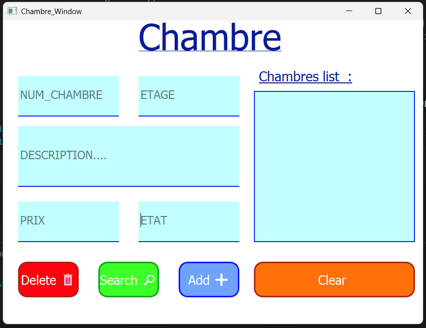
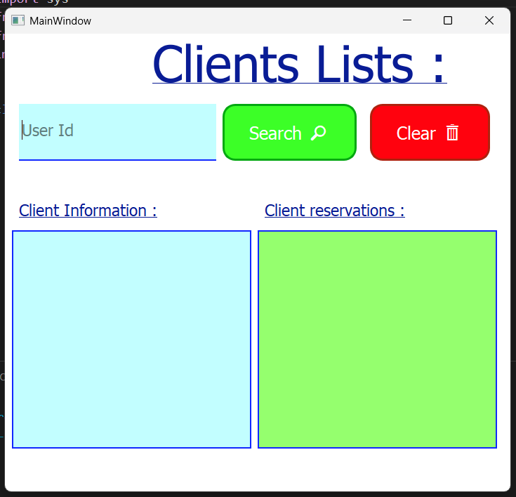
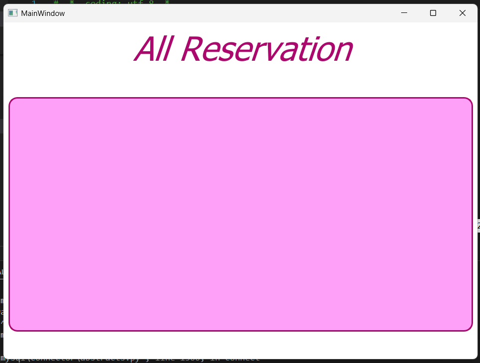
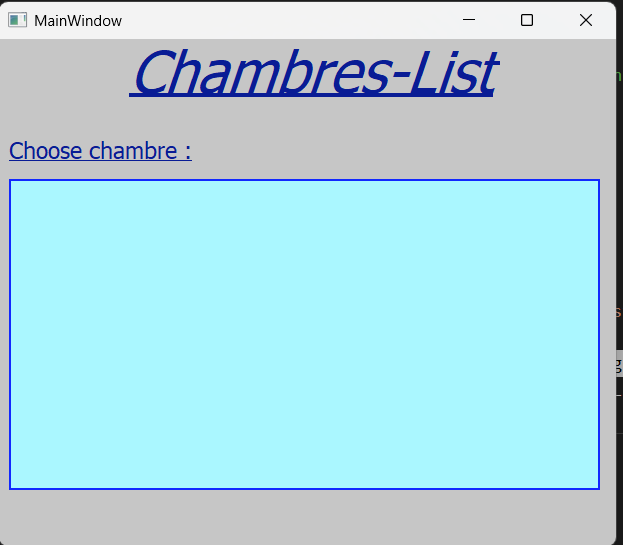
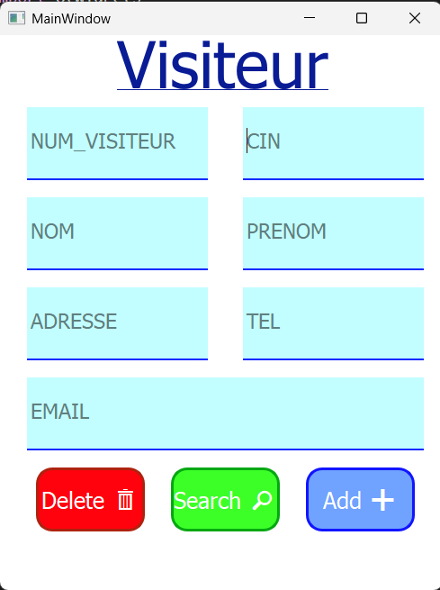

**Hotel Management Application**  
================================

**Overview**  
The Hotel Management Application is a comprehensive software solution designed to optimize hotel operations. Developed in Python using PyQt5 and Qt Designer, it offers a centralized platform to manage reservations, guests, rooms, and billing, ensuring seamless workflows and efficiency.

---

**Core Features**

1. **Guest Management**

   - Add, update, and view guest details effortlessly.
   - Maintain detailed profiles for better customer tracking.

2. **Room Management**

   - Monitor real-time room availability.
   - Assign rooms to guests and manage room-specific attributes.

3. **Reservation System**

   - Simplify the booking process, from reservations to check-ins and check-outs.

4. **Billing and Invoicing**
   - Generate accurate and professional-grade invoices with ease.

---

**Key Highlights**

1. **Advanced Input Validation**

   - Phone Numbers: Ensures proper 10-digit formatting using regular expressions.
   - Email Addresses: Validates correct formats through regex checks.
   - Displays detailed error messages for invalid or incomplete inputs.

2. **Comprehensive CRUD Operations**

   - **Create**: Add validated records to the database.
   - **Read**: Retrieve details using unique identifiers like reservation or visitor numbers.
   - **Update**: Modify existing data while ensuring integrity.
   - **Delete**: Remove records with user confirmation and validation.

3. **Enhanced User Experience**
   - Uses QMessageBox for clear feedback, confirmations, and error handling.
   - Automatically clears input fields after successful operations or errors.

---

**Screenshots**  
The application interface includes various screens designed for functionality and ease of use:

1. **Chambre Screen**  
   Displays room-related details and management options.  
   

2. **Client List**  
   Shows a comprehensive list of all guests in the database.  
   

3. **Display All Reservations**  
   Provides a complete overview of current and past reservations.  
   

4. **Display All Available Rooms**  
   Highlights rooms currently available for booking.  
   

5. **Visiteurs Management**  
   Facilitates managing visitor records.  
   

---

**Technical Details**

- **Technology Stack**

  - PyQt5: Rich graphical user interface.
  - MySQL: Reliable and scalable database backend.
  - Python: Application logic and database interactions.

- **Code Design**
  - Modular SQL Queries: Parameterized for enhanced security and prevention of SQL injection.
  - Reusable Components: Common functionalities (e.g., error handling, messaging) encapsulated into helper methods.

---

**Context for Educational Use**  
This application serves as a showcase of skills in GUI design, SQL database interaction, and error handling. For further improvement:

- Integrate advanced SQL features like joins, triggers, and stored procedures.
- Add data export options for reporting (e.g., to CSV or PDF).

---
